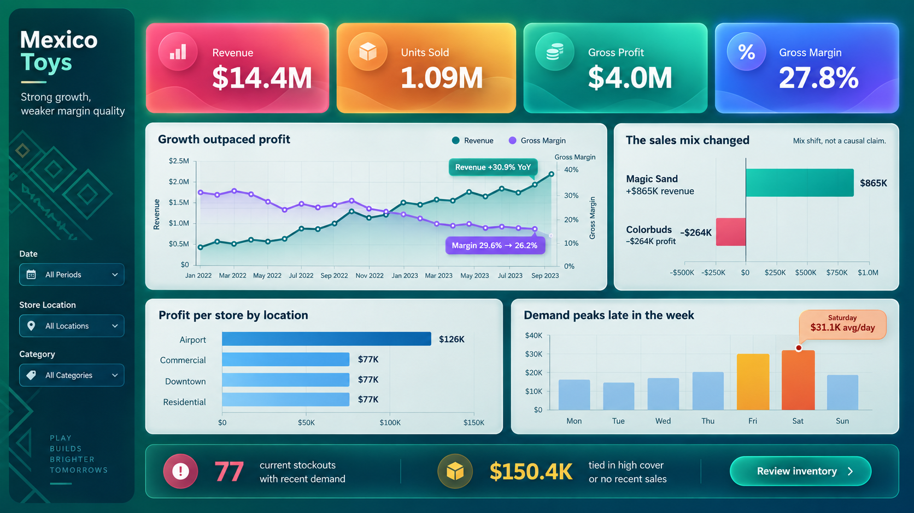

# Mexico Toys Sales & Inventory Analysis

Portfolio project analyzing sales and inventory performance for Maven Toys in Mexico. It combines SQL, Excel, and Tableau to explain revenue growth, margin pressure, and imbalances between inventory and recent demand.

The primary deliverable is the packaged interactive Tableau workbook [`dashboard/mexico_toys_final.twbx`](dashboard/mexico_toys_final.twbx), which contains the **Overview** and **Inventory Action** dashboards together with their data and image assets. The concept images included in the repository are visual design references, not screenshots of the completed dashboard.

## Executive summary

- **$14.4M** in revenue and **$4.0M** in gross profit during the analyzed period.
- From January through September 2023, revenue increased **30.9% year over year**, while gross margin declined from **29.6% to 26.2%**.
- Reported inventory represents **$300.2K at cost** and approximately **16.5 days of estimated coverage**.
- **77 store-product combinations** are out of stock despite showing recent demand.
- **$150.4K** is tied up in inventory with more than 30 days of coverage or no recent sales.

The Tableau workbook includes two connected dashboards:

1. **Overview:** revenue, units sold, gross profit, gross margin, and commercial performance trends.
2. **Inventory Action:** coverage, stockout risk, tied-up capital, and replenishment priorities.

## Technology stack

- **SQLite:** relational model, reusable metrics, and reproducible queries.
- **Excel:** executive review, annotated findings, and analysis-ready tables.
- **Tableau:** executive dashboards covering commercial performance and inventory.

## Repository structure

- `data/raw/`: unchanged source files.
- `data/processed/`: cleaned dimensions and reported inventory.
- `data/export/`: lightweight outputs prepared for Excel and Tableau.
- `sql/`: schema, analytical views, and business queries.
- `scripts/`: end-to-end project rebuild.
- `docs/`: methodology, findings, limitations, validation, and dashboard design.
- `dashboard/mexico_toys_final.twbx`: final packaged Tableau workbook.
- `dashboard/mexico_toys_tableau.twb`: earlier editable Tableau source retained for reference.
- `kpi-icons/`: transparent KPI icons and supporting dashboard graphics.
- `dashboard/`: visual assets, design specification, and Tableau build guide.
- `outputs/`: generated Excel analysis workbook.

## Reproduce the analysis

From the project root, run:

```bash
python3 scripts/build_project.py
```

This recreates `sql/mexico_toys.db`, the cleaned datasets, and all analytical exports.

Open `dashboard/mexico_toys_final.twbx` to explore the finished dashboards. The packaged workbook already contains the required Tableau data sources and image assets.

The source exports are also available separately at:

- `data/export/dashboard_sales.csv`
- `data/export/inventory_analysis.csv`
- `data/export/weekday_performance.csv`

The complete Excel analysis is available at `outputs/01a0c449-42d0-7ea3-b248-27cdd5d48ea7/mexico_toys_analysis.xlsx`.

## Business questions

1. Which product categories generate the most gross profit, and does performance vary by store location?
2. What sales and profitability trends appear over time?
3. Which store-product combinations have zero stock despite showing recent demand?
4. How much capital is invested in inventory, and how many days could that inventory cover?

Potential lost sales are presented as **demand exposure**, not as measured historical lost sales, because the dataset contains only an inventory snapshot and does not include inventory movements or replenishment dates.

## Documentation

- [Findings](docs/findings.md)
- [Methodology](docs/methodology.md)
- [Limitations](docs/limitations.md)
- [Validation report](docs/validation_report.md)
- [Dashboard specification](docs/dashboard_spec.md)
- [Visual concept audit](docs/visual_concept_audit.md)

## Visual concept

The following image is an early visual exploration. It remains a reference for color, hierarchy, and visual depth, but **it is not a Tableau export**. The headline KPIs and executive callouts were validated; the geometry of some charts is illustrative and should not be interpreted as an exact representation of the data.


