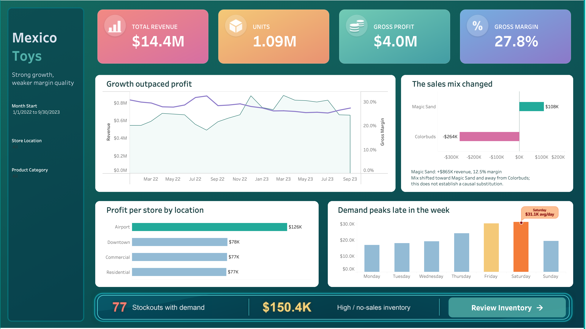
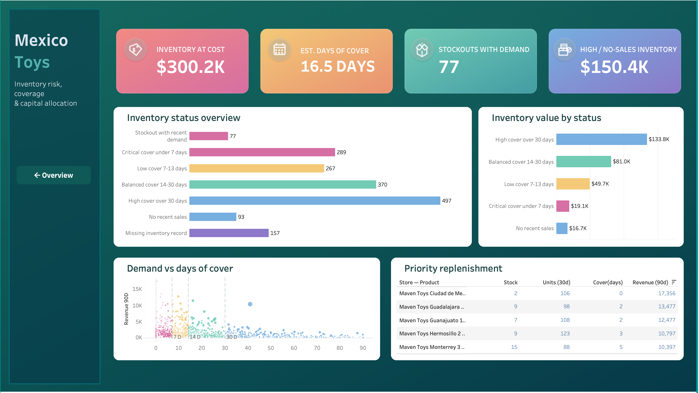

# Tableau dashboard

The completed workbook is `mexico_toys_final.twbx` and contains two dashboards:

- **Overview:** commercial performance, revenue trend, margin, product mix, store-location productivity and weekday demand.
- **Inventory Action:** inventory value, estimated coverage, stockout exposure, status distribution and replenishment priorities.

This packaged workbook is the authoritative dashboard deliverable and includes its data sources and image assets. `mexico_toys_tableau.twb` is retained as an earlier editable source.

Data sources:

- `../data/export/dashboard_sales.csv`
- `../data/export/inventory_analysis.csv`
- `../data/export/weekday_performance.csv`

The sources intentionally remain separate because they use different grains. They are embedded in the packaged workbook and also remain available in the repository for reproducibility.

Supporting files include the color palette, final KPI assets, dashboard specification and build guide.
